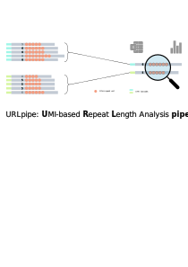

# 

## Table of Contents
[Introduction](#introduction)  
[Pipeline summary](#pipeline-summary) 
[Quick Start](#quick-start)  
[Documentation](#documentation)  
[Credits](#credits)  
[Bug report/Support](#bug-reportsupport)  
[Citations](#citations)   
[Release notes](#release-notes)

## Introduction

Gene editing via CRISPR/Cas9 technologies has emerged as a promoising strategy to treating certain Repeat Expansion Diseases (REDs) including Huntington's Disease (HD) by permanantly reducing the length of pathogenic expansions in DNA regions. One crucial step in this process is evaluating the editing results, which involves checking for undesired Insertions and Deletions (INDELs) near the targeted editing sites and determining the edited length of the DNA repeat expansion through sequencing. However, accurately determining the editing outcomes remains a challenge due to PCR artifects caused by polymerase slippage in repetitive DNA regions, decreased efficiency when amplifying larger fragments, and sequencing errors. The URLpipe (UMI-based Repeat Length analyssi pipeline) tackles this problem by leveraging **U**nique **M**olecular **I**dentifier (UMIs) to improve the accuracy of inferring gene editing outcomes.

Powered by [Nextflow](https://www.nextflow.io), URLpipe is designed to be user-friendly and portable, enabling execution across various compute infrastructures through Docker/Singularity technologies. URLpipe takes raw fastq files as input and generates statistical tables and plots that summarize the editing outcomes. Below is an overview of the design and the implemented sub-workflows/modules in URLpipe.

The development of the pipeline is guided by  [nf-core TEMPLATE](https://github.com/nf-core/tools/tree/master/nf_core/pipeline-template).

## Pipeline Summary

URLpipe supports sequencing reads from both Illumina and Nanopore platforms. The relevant sub-workflows/modules are illustrated in the diagram below. For detailed instructions on configuring your analysis and examples, refer to the [usage](https://github.com/hukai916/URLpipe/blob/main/docs/usage.md) documentation.

<p align="center">
  
</p>

### Illumina reads

The Illumina branch of the pipeline is structured into eight distinct sub-workflows, each with a specific role in processing data:
  - **INPUT_CHECK**:
    - Purpose: validate the input files and configurations to ensure they meet the requirements for analysis
  - **PREPROCESS_QC**: 
    - Purpose: perform preprocessing and quality control on the raw data
    - Result folder: `1_preprocess` and `2_qc_and_umi`
  - **CLASSIFY_READ**:
    - Purpose: categorize reads into different classes to facilitate downstream analysis
    - Result folder: `3_read_category`
  - **REPEAT_STAT_DEFAULT** and **REPEAT_STAT_MERGE**:
    - Purpose: determine repeat lengths by leveraging UMI
    - Result folder: `4_repeat_statistics`
  - **INDEL_STAT**:
    - Purpose: analyze patterns of insertions and deletions around the repeat region
    - Result folder: `5_indel_statistics`
  - **GET_SUMMARY**:
    - Purpose: generate tables and plots summarizing the editng outcome
    - Result folder: `6_summary`

Selected sub-workflow and their functionalities are summarized below. Refer to [output - Result folders](https://github.com/hukai916/URLpipe/blob/main/docs/output.md#result-folders) documentation for more details.

#### PREPROCESS_QC:

<p align="center">
  
</p>

1. Merge fastq files from different lanes (if any) that belong to the same library (`1a_lane_merge`)
2. Extract UMI from each read and append it to the read name (`1b_umi_extract`)
3. Trim adapter sequences (`1c_cutadapt`)
4. Quality control using FastQC (`2a_fastqc`)
5. Quality control by plotting read count per UMI (`2b_read_per_umi_cutadapt`)

#### CLASSIFY_READ:

<p align="center">
  
</p>

1. Determine if read is mapped to the predefined target region (on-locus) (`3a_classify_locus`)
2. Classify on-locus reads based on the presence of INDELs around the repeat region (non-indel) (`3b_classify_indel`)
3. Classify non-indel reads For each non-indel read, determine if it covers the entire repeat region (readthrough) (`3c_classify_readthrough`)

The readthrough reads will be used towards determining the repeat lengths.

#### REPEAT_STAT_DEFAULT/MERGE:

In URLpipe, repeat length determination can be performed in two modes: DEFAULT mode, which uses only R1 reads, and MERGE mode, which merges R1 and R2 reads. For UMI correction, four methods are currently available: "mode", "mean", and "least distance", and "square distance".

<p align="center">
  
</p>

1. Figure out repeat length distribution (`4a_repeat_length_distribution`)
2. Perform UMI correction to refine repeat length measurements (`4a_repeat_length_distribution`)
3. Plot the repeat length distribution per UMI (`4b_4a_repeat_length_distribution_per_umi`)

#### INDEL_STAT:

Gather statistic information for reads containing INDELs.

#### GET_SUMMARY:

Obtain summary statistics from CLASSIFY_READ, REPEAT_STAT_DEFAULT/MERGE, and INDEL_STAT results.

1. Generate master statistic tables (`6a_master_table`)
2. Generate summary plots (`6b_bin_plot`)

### Nanopore reads

The setup for the Nanopore branch is quite similar to that of the Illumina branch, with the main difference being the inclusinog of an optional `PREPROCESS_NANOPORE` sub-workflow specifically designed for pre-processing Nanopore data. 

## Quick Start

1. Install [`nextflow`](https://nf-co.re/usage/installation)(>=23.10.0).

2. To avoid potential issues with dependency installation, all URLpipe dependencies are built into images. Therefore, you should install either [`Docker`](https://docs.docker.com/engine/installation/) or [`Singularity (Apptainer)`](https://www.sylabs.io/guides/3.0/user-guide/) and specify `-profile singularity` or `-profile docker`, respectively, when running URLpipe. Otherwise, you will need to manually install all dependencies and ensure they are available on you local PATH, **which is unlikely to be the case!**

3. Download the pipeline:
```bash
git clone https://github.com/hukai916/URLpipe.git
cd URLpipe
```

4. Download a minimal test dataset:
    * The **dataset1** comprises a subset of samples from a CRISPR editing experiment using the HQ50 (Human) cell line. HQ50 cells contain two HTT alleles with differing CAG-repeat lengths: one with approximately 18CAG/20Q and the other with approximately 48CAG/50Q. The objective of the experiment is to examine the editing outcomes when treated with various DNA damage repair inhibitors. For demonstration purposes, six samples (three conditions, each with two replicates) have been selected:
    - Two samples with no electroporation (no_E), serving as the unedited control. 
    - Two samples with no inhibitor (noINH_DMSO), serving as the edited control.
    - Two samples with the D103 inhibitor (D103_10uM) to assess its effect on the editing outcome.

  ```bash
  wget https://www.dropbox.com/scl/fi/b4xspm0ydq4y1p8s9u55g/sample_dataset1.zip
  unzip sample_dataset1.zip
  ```

5. Edit the `replace_with_full_path` in the assets/samplesheet_dataset1.csv to use the actual **full path**.

6. Test the pipeline with this minimal dataset1:

  * At least 2GB memory is recommended for dataset1.
  * By default, the local executor (your local computer) will be used (`-profile local`) meaning that all jobs will be executed on your local computer. Nextflow supports many other [executors](https://www.nextflow.io/docs/latest/executor.html) including SLURM, LSF, *etc.*. You can create a [profile](https://www.nextflow.io/docs/latest/config.html?highlight=profile#config-profiles) file to config which executor to use. Multiple profiles can be supplied with comma, e.g. `-profile docker,lsf`.
  * Please check [nf-core/configs](https://github.com/nf-core/configs#documentation) to see what other custom config files can be supplied.

  * **Example command for run URLpipe with Docker and local executor:**
  ```bash
  nextflow run main.nf -c conf/sample_dataset1.config -profile docker,local
  ```

By executing the above command:
  - The "local executor" (`-profile local`) will be used. 
  - The "docker" (`-profile docker`) will be leveraged. 
  - The configurations specified via `-c conf/sample_dataset1.config` will be applied, which includes:
    - `input  = "./assets/samplesheet_dataset1.csv"`: input samplesheet file path
    - `outdir = "./results_dataset1"`: output directory path
    - `allele_number = 2`: 
    - `length_mode = "reference_align"`: repeat length determination method
    - `ref = "assets/IlluminaHsQ50FibTrim_Ref.fa"`: target reference fasta file
    - `max_memory                 = "16.GB"`: maximum memory to use, do not exceed what your system has
    - `max_cpus                   = 16`: maximum number of cpu to use, do not exceed what your system has
    - `max_time                   = "240.h"`: maximum running time
    - other module-specific configurations

Detailed explanations, refer to [usage](docs/usage.md).

 * **Example command for running URLpipe with Singularity and LSF executor:**
```bash
nextflow run main.nf -c conf/sample_dataset1.config -profile singularity,local
```

Like the first example, the above command directs the pipeline to use Singularity and LSF executor rather than Docker and local executor by `-profile singularity,lsf`.
  - Note, Singularity images will be downloaded and saved to `work/singularity` directory by default. It is recommended to configure the [`NXF_SINGULARITY_CACHEDIR` or `singularity.cacheDir`](https://www.nextflow.io/docs/latest/singularity.html?#singularity-docker-hub) settings to store the images in a central location.

7. Run your own analysis:
  * Typical commands:
```bash
# Supply configurations through command flags
nextflow run main.nf -profile <singularity/docker/lsf/local> --input <path_to_input_samplesheet_file> --outdir <path_to_result_dir> --allele_number <1/2> --length_mode <reference_align/distance_count> --ref <path_to_ref_file> ...

# Or include configurations into a single file, e.g. test.config
nextflow run main.nf -profile <singularity/docker/lsf/local> -c test.config
```

  * For help: # todo
```bash
nextflow run main.nf --help
```

See documentation [usage](docs/usage.md) for all of the available options.

## Documentation

The URLpipe workflow includes comprehensive documention, covering both [usage](https://github.com/hukai916/URLpipe/blob/main/docs/usage.md) and [output](https://github.com/hukai916/URLpipe/blob/main/docs/output.md).

## Credits

URLpipe was originally designed and written by Kai Hu, Michael Brodsky, and Lihua Julie Zhu. We also extend our gratitude to Rui Li, Haibo Liu, Junhui Li for their extensive assistance in the development of this tool.

## Bug report/Support

For help, bug reports, or feature requests, please create a GitHub issue by clicking [here](https://github.com/hukai916/URLpipe/issues/new/choose). If you would like to extend URLpipe for your own use, feel free to fork the repository.

## Citations: todo
<!-- TODO If you use URLpipe for your analysis, please cite it using the following doi: [](https://) -->
Please cite [URLpipe](to be added) if you use it for your research.

A ***Template of Method*** can be found [here](https://github.com/hukai916/URLpipe/blob/main/docs/template_of_method.docx).

A complete list of references for the tools used by URLpipe can be found [here](https://github.com/hukai916/URLpipe/blob/main/docs/URLpipe_module_references.xlsx).

## Release notes
<details markdown="1">
<summary>v0.1.0</summary>   

  * initial release
</details>
