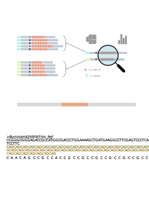

# URLpipe: Usage
(Some parts adapted from nf-core [TEMPLATE](https://github.com/nf-core/tools/blob/master/nf_core/pipeline-template/docs/usage.md).)

## Table of Contents

[Introduction](#introduction)   
[Samplesheet input](#samplesheet-input)   
[Running the pipeline](#running-the-pipeline)   
[Nextflow-level arguments](#nextflow-level-arguments)   
[Pipeline-level arguments](#pipeline-level-arguments)   
[Module-level arguments](#module-level-arguments)   
[Custom configurations](#custom-configurations)   
[Example study1](#example-study1)   
[Running in the background](#running-in-the-background)   
[Nextflow memory requirements](#nextflow-memory-requirements)   
[Version control](#version-control)   

## Introduction

To use URLpipe, first install Nextflow and other necessary dependencies as outlined in the [Quick start](../README.md#quick-start) section. You will need to provide the appropriate configurations and supply an input samplesheet CSV file containing the sequencing data information. The format for the samplesheet is detailed in the [Samplesheet input](#samplesheet-input) section. 

ULRpipe, like all Nextflow-powered pipelines, can be configured at three levels:

  - **Nextflow level**: Configured with a single dash (`-`), the [Nextflow-level arguments](#nextflow-level-arguments) control the overal behavior of Nextflow engine.
  - **Pipeline level**: Configured with a double dash (`--`), the [Pipeline-level arguments](#pipeline-level-arguments) define parameters in the `params` scope that control the behavior of URLpipe workflow. 
  - **Module level**: Configured in the `process` scope, the [Module-level arguments](#module-level-arguments) allow fine-tuning of each individual module in URLpipe workflow.

These arguments can be passed with command line flags or stored in a separate configuration file and passed in with [`-c`](#-c) flag.
  
You can also use the following command (#todo) to view all parameters.
```bash
cd URLpipe
nextflow run main.nf --help
```

Refer to [output](output.md) for example commands and results.

## Samplesheet input

To begin, You must create a samplesheet containing information about your samples. This should be a comma-separated file with seven columns and a header row, as shown in the examples below. Use the command line flag (`--input`) to specify the file's location, or include `input = "path_to_samplesheet_file"` in a custom configuration file and pass it in using [`-c`](#-c) flag.

```nextflow
--input '[path to samplesheet file]'
```

### Samplesheet example

An example samplesheet with six samples, as used in the [Quick start](https://github.com/hukai916/URLpipe/blob/main/docs/README.md#quick-start) section, is provided as below. You can also find this file at [`assets/samplesheet_dataset1.csv`](../assets/samplesheet_dataset1.csv).

| sample         | fastq_1                                      | fastq_2                                      | start_allele_1 | end_allele_1 | start_allele_2 | end_allele_2 |
|----------------|----------------------------------------------|----------------------------------------------|----------------|--------------|----------------|--------------|
| D103_10uM_R1   | /replace_with_full_path/DI1-13_R1_001.fastq.gz | /replace_with_full_path/DI1-13_R2_001.fastq.gz | 51             | 60           | 138            | 154          |
| D103_10uM_R2   | /replace_with_full_path/DI2-13_R1_001.fastq.gz | /replace_with_full_path/DI2-13_R2_001.fastq.gz | 51             | 60           | 138            | 154          |
| No_E_R1        | /replace_with_full_path/DI1-19_R1_001.fastq.gz | /replace_with_full_path/DI1-19_R2_001.fastq.gz | 51             | 60           | 138            | 154          |
| No_E_R2        | /replace_with_full_path/DI2-18_R1_001.fastq.gz | /replace_with_full_path/DI2-18_R2_001.fastq.gz | 51             | 60           | 138            | 154          |
| noINH_DMSO_R1  | /replace_with_full_path/DI1-16_R1_001.fastq.gz | /replace_with_full_path/DI1-16_R2_001.fastq.gz | 51             | 60           | 138            | 154          |
| noINH_DMSO_R2  | /replace_with_full_path/DI2-16_R1_001.fastq.gz | /replace_with_full_path/DI2-16_R2_001.fastq.gz | 51             | 60           | 138            | 154          |f


| Column    | Description                                                                                                                                                                            |
| --------- | -------------------------------------------------------------------------------------------------------------------------------------------------------------------------------------- |
| `sample`  | The sample name. This entry should be identical for multiple sequencing libraries or runs from the same sample. Spaces in sample names will be automatically converted to underscores (`_`). Avoid using special characters. |
| `fastq_1` | Full path to the FastQ file for Illumina short reads 1 or Nanopore FastQ file. The file must be gzipped and have the extension ".fastq.gz" or ".fq.gz". |
| `fastq_2` | Full path to the FastQ file for Illumina short reads 2. Leave this field empty if using Nanopore FastQ file. The file must be gzipped and have the extension ".fastq.gz" or ".fq.gz". |
| `start_allele_1` | Integer specifying the lower bound of the repeat length in base pairs (bp) for allele 1, used for plotting. |
| `end_allele_1` | Integer specifying the upper bound of the repeat length in base pairs (bp) for allele 1, used for plotting. |
| `start_allele_2` | Integer specifying the lower bound of the repeat length in base pairs (bp) for allele 2, used for plotting. Leave empty if allele 2 does not exist. |
| `end_allele_2` | Integer specifying the upper bound of the repeat length in base pairs (bp) for allele 2, used for plotting. Leave empty if allele 2 does not exist. |

### Multiple runs of the same sample

The "sample" identifiers in the `sample` column must be the same for the same sample sequenced multiple times (across different runs or lanes) to increase sequencing depth. The pipeline will concatenate these reads before performing any downstream analysis. Below is an example of a sample sequenced across three lanes:

| sample         | fastq_1                                      | fastq_2                                      | start_allele_1 | end_allele_1 | start_allele_2 | end_allele_2 |
|----------------|----------------------------------------------|----------------------------------------------|----------------|--------------|----------------|--------------|
| D103_10uM_R1   | /replace_with_full_path/DI1-13_L001_R1_001.fastq.gz | /replace_with_full_path/DI1-13_L001_R2_001.fastq.gz | 51             | 60           | 138            | 154          |
| D103_10uM_R1   | /replace_with_full_path/DI1-13_L002_R1_001.fastq.gz | /replace_with_full_path/DI1-13_L002_R2_001.fastq.gz | 51             | 60           | 138            | 154          |
| D103_10uM_R1   | /replace_with_full_path/DI1-13_L003_R1_001.fastq.gz | /replace_with_full_path/DI1-13_L003_R2_001.fastq.gz | 51             | 60           | 138            | 154          |

## Running the pipeline

The typical command for running URLpipe is as follows:

```nextflow
# Supply configurations through command flags
nextflow run main.nf -profile <singularity/docker/lsf/local> --input <path_to_input_samplesheet_file> --outdir <path_to_result_dir> --allele_number <1/2> --length_mode <reference_align/distance_count> --ref <path_to_ref_file> ...

# Or include configurations into a single file, e.g. test.config
nextflow run main.nf -profile <singularity/docker/lsf/local> -c test.config
```

Note that the pipeline will create the following folders and files in your working directory:

```bash
work            # Directory containing Nextflow working files
<OUTDIR>        # Directory for finished results (specified with --outdir)
.nextflow_log   # Log file generated by Nextflow
```

For more about flag arguments, see the [Nextflow-level arguments](#nextflow-level-arguments) and [Pipeline-level arguments](#pipeline-level-arguments) sections. For general guidance on Nextflow configurations, consult the [Nextflow config documentation](https://www.nextflow.io/docs/latest/config.html).

## Nextflow-level arguments

> **NB:** These options are part of Nextflow and use a _single_ hyphen whereas pipeline-level parameters use a double-hyphen.

### -profile

Use this parameter to choose a configuration profile. Profiles can give configuration presets for different compute environments.

Several generic profiles are bundled with the pipeline which instruct the pipeline to use software packaged using different methods (Docker, Singularity, Podman, Shifter, Charliecloud, Conda) - see below. When using Biocontainers, most of these software packaging methods pull Docker containers from quay.io e.g [FastQC](https://quay.io/repository/biocontainers/fastqc) except for Singularity which directly downloads Singularity images via https hosted by the [Galaxy project](https://depot.galaxyproject.org/singularity/) and Conda which downloads and installs software locally from [Bioconda](https://bioconda.github.io/).

> We highly recommend the use of Docker or Singularity containers for full pipeline reproducibility, however when this is not possible, Conda is also supported is if specific pipeline developers implement it.

Note that multiple profiles can be loaded, for example: `-profile test,docker` - the order of arguments is important!
They are loaded in sequence, so later profiles can overwrite earlier profiles.

If `-profile` is not specified, the pipeline will run locally and expect all software to be installed and available on the `PATH`. This is _not_ recommended.

- `docker`
  - A generic configuration profile to be used with [Docker](https://docker.com/)
- `singularity`
  - A generic configuration profile to be used with [Singularity](https://sylabs.io/docs/)
- `podman`
  - A generic configuration profile to be used with [Podman](https://podman.io/)
- `shifter`
  - A generic configuration profile to be used with [Shifter](https://nersc.gitlab.io/development/shifter/how-to-use/)
- `charliecloud`
  - A generic configuration profile to be used with [Charliecloud](https://hpc.github.io/charliecloud/)
- `conda`
  - A generic configuration profile to be used with [Conda](https://conda.io/docs/). Please only use Conda as a last resort i.e. when it's not possible to run the pipeline with Docker, Singularity, Podman, Shifter or Charliecloud.
- `test`
  - A profile with a complete configuration for automated testing
  - Includes links to test data so needs no other parameters

### -resume

Specify this when restarting a pipeline. Nextflow will use cached results from any pipeline steps where the inputs are the same, continuing from where it got to previously. For input to be considered the same, not only the names must be identical but the files' contents as well. For more info about this parameter, see [this blog post](https://www.nextflow.io/blog/2019/demystifying-nextflow-resume.html).

You can also supply a run name to resume a specific run: `-resume [run-name]`. Use the `nextflow log` command to show previous run names.

### -c

Specify the path to a specific config file. See the [nf-core website documentation](https://nf-co.re/usage/configuration) for more information.

## Pipeline-level arguments

> **NB:** These options are part of URLpipe workflow and use a _double_ hyphen (Nextflow-level parameters use a single-hyphen).

**Pipeline parameters** should be provided either through command-line flags, configured in "nextflow.confg" file, or specified in a custom configuration file. The details of these parameters are described below. Note that some pipeline parameters need to be used in conjunction with [Module-level arguments](#module-level-arguments) to achieve the desired results as detailed further below.

### Input options: choose one
```
--input                     [string] Path to the input samplesheet CSV file. Defaults to null.
--input_nanopore_preprocess [string] Path to the input samplesheet CSV file. For preprocessing Nanopore reads. Defaults to null.
```

### Ouptut directory
```
--outdir                    [string] Path to the output directory.
```

### Reference information
```
--ref                       [string] Path to the reference fasta file.
--ref_repeat_start          [int] 1-based repeat region start coordinate on the reference sequence.
ref_repeat_end              [int] 1-based repeat region end coordinate on the reference sequence.
ref_repeat_unit             [string] Repeat unit (e.g. "CAG").
```

### Repeat length determination
```
--length_mode               [string: distance_count|reference_align] Method used to determine repeat length. Defaults to "distance_count". For details, refer to the manuscript. 
--umi_cutoffs               [string] UMI group read count cutoffs for UMI correction. Defaults to "1,3,5,7,10,30,100" with "0" (no correction) added automatically. The default means that reads will be collapsed at 8 UMI group levels: 0 (no correction), 1 (UMI groups with at least 1 read collapse into a single read each), 3 (UMI groups with at least 3 reads collapse into a signle read each), etc.
--umi_correction_method     [string: least_distance|mode|mean|least_absolute] Method for UMI correction. Details see the manuscript.
```

### Plotting
```
--repeat_bins               [string] Ranges of repeat length (per-bp) bins for plotting purposes. Defaults to "[(0,50), (51,60), (61,137), (138,154), (155,1000)]", which means that repeat lengths falling into each range will be counted and plotted.
--allele_number             [int: 1|2] Number of alleles in the target genome for plotting purposes. Defaults to 1. If set to 1, provide "start_allele_1" and "end_allele_1" in the input samplesheet. If set to 2, provide "start_allele_1", "end_allele_1", "start_allele_2" and "end_allele_2".
```

### Running mode
```
--mode                      [string: default|merge|nanopore|nanopore_preprocess] Controls the behavior of the URLpipe. Defaults to "default", meaning that the Illumina branch will be executed using "R1" reads while "merge" will merge "R1" and "R2" before downstream analysis. Set to "nanopore_preprocess" to preprocess nanopore fastq file including trimming, count barcode occurrence, split into either directions, demultiplex, etc. while "nanopore" analyzes preprocessed nanopore reads.
```

### Nanopore mode specific arguments
```
  // reference for nanopore mode # todo: move to modules like Illumina
--ref                       [string] Path to target reference sequence file.
  // reads to keep for Nanopore mode
--filter_reads              [string: forward_only|reverse_only|both_forward_reverse] Reads to retain for Nanopore mode. Defaults to "both_forward_reverse", meaning reads from both directions will be kept for downstream analysis.
```

### Max resource options: do not exceed your system limits
```
--max_memory                [string] Maximum allowed memory. Defaults to "32.GB".
--max_cpus                  [int] Maximum allowed CPUs. Defaults to 16.
--max_time                  [string] Maximum allowed running time. Defaults to "240.h".
```

Below are module-level parameters that must be configured based on the pipeline-level parameter:

- Pipeline-level parameter: `--length_mode`
  - If set to "reference_align", configure the following module-level parameters: 
    - `PREP_REF`: conf/repeat_stat_default.config
    - `BWA`: conf/repeat_stat_default.config
    - `BWA_LENGTH`: conf/repeat_stat_default.config
  - If set to "distance_count", configure the following module-level parameter:
    - `REPEAT_LENGTH_DISTRIBUTION_DEFAULT`: conf/repeat_stat_default.config

Refer to [Module-level parameters](#module-level-parameters) below for details.

## Module-level arguments

The module-level parameters, specified within the `process` scope, fine-tune the behavior of individual modules in URLpipe and must be adjusted to fit your specific data. These parameters are organized by sub-workflows for convenient access, as outlined in the "conf/modules.config" file. Also note that, some module-level arguments should be used in conjunction with pipeline-level arguments.

Below is an overview of key module parameters by subworkflow. Refer to [Module-specific options](#module-specific-options) for detailed explanations on how to configure module-level parameters.

- "conf/preprocess_qc.config"
  - module `CUTADAPT`
    - `ext.args = '-g GTAGGCTCCAAGTCTTCAGGGTCTGT -G CGGCTGAGGCAGCAGCGGCTGT'`: Define the adapter sequences to trim using the Cutadapt tool.
  - module `UMI_EXTRACT`
    - `ext.args = '--bc-pattern=NNNNNNNNNN'`: Specify the expected UMI pattern.

- "conf/preprocess_nanopore.config": # todo

- "classify_read.config"
  - module `CLASSIFY_LOCUS` 
    - Define the nucleotide sequences for identifying on-locus reads (reads that map to the target reference region).  
    - `ext.ref_start_bp_to_check = 20`: Number of base pair to examine from ref start.
    - `ext.ref_end_bp_to_check = 20`: Number of base pair to examine from ref end.
    - `ext.m = 2`: Number of allowed mismatches (INDELs are permitted).
  - module `CLASSIFY_INDEL`
    - Define the nucleotide sequences for detecting non-indel reads. 
    - `ext.ref_before_repeat_bp_to_check = 20`: Number of base pair to examine from ref repeat start site.
    - `ext.ref_after_repeat_bp_to_check = 20`: Number of base pair to examine from ref repeat end site.
    - `ext.m = 2`: Number of allowed mismatches (substitutions only).
    - `ext.indel_cutoff = 0.5`: Set the fraction cutoff for reads with INDELs within a UMI group. Defaults to 0.5, which means that if more than 50% of reads in a UMI group contain INDELs, the UMI group will be classfied as having INDELs.
  - module `CLASSIFY_READTHROUGH`
    - Define the nucleotide sequences for identifying readthrough reads. INDELs are permitted. This can be identical to the sequences used in `CLASSIFY_INDEL`.
    - `ext.ref_before_repeat_bp_to_check = 20`: Number of base pair to examine from ref repeat start site.
    - `ext.ref_after_repeat_bp_to_check = 20`: Number of base pair to examine from ref repeat end site.
    - `ext.m = 2`: Number of allowed mismatches (INDELs are permitted).
  - module `READ_PER_UMI_READTHROUGH`
    - `ext.args = "500"`: Specify the X-axis range for plotting. Choose "auto" for automatic scaling or a positive number for a fixed range.

- "classify_read_nanopore.config": # todo

- "adaptor_count_wf.config": # todo

- "repeat_stat_default.config":
  - module `PREP_REF`: Relevant if `--length_mode` is set to "reference_align". This module prepares a series of artifical references with varying numbers of repeat units
    - `ext.reference = "assets/IlluminaMmQ50Trim_Ref.fa"`: Path to the target reference sequence.
    - `ext.repeat_start = 73`: 1-based coordinate of the repeat start site on the reference. 
    - `ext.repeat_end = 234`: 1-based coordinate of the repeat end site on the reference. 
    - `ext.repeat_unit = "CAG"`: Repeat unit sequence in the repeat region.
    - `ext.repeat_range = "0:150"`: Range of repeat unit numbers to include in the artifical references, "0:150" means 151 artifical refereences will be prepared, with repeat unit count range from 0 t0 150.
  - module `REPEAT_LENGTH_DISTRIBUTION_PER_UMI`
    - `ext.args = 10`: Number of UMI groups to calculate and plot for repeat length distribution per UMI statistics.

- "repeat_stat_merge.config"
  - module `REPEAT_LENGTH_DISTRIBUTION_PER_UMI_MERGE`
    - `ext.args = 10`: Number of UMI groups to calculate and plot repeat length distribution per UMI statistics.

- "repeat_stat_nanopore.config" # todo

- "indel_stat.config": # No parameters exported

- "get_summary.config"
  - module `GET_BIN_PLOT`
    - `ext.use_repeat_unit_bp = "no"`: Set to "yes" to use the length of "repeat units" for plotting. If "no", the plot will use the length of repeat base pairs. The length of "repeat unit" is defined by "repeat_unit_bp" below.
    - `ext.repeat_unit_bp = 3`: Number of base pairs in the repeat unit.

## Custom configurations

The Nextflow engine provides flexibility in managing computational resource requests and module-specific options. These configurations can be saved into a centralized configuration file and passed to URLpipe with the `-c` flag. Below is the configuration file and command line used in [Quick start](../README.md#quick-start)

```nextflow
nextflow run main.nf -c conf/sample_dataset1.config -profile docker,local
```

### Resource requests
While the default requirements set within the pipeline are designed to work for most users and input data, you may need to customize these resources based on your specific needs. Each pipeline step has default settings for CPUs, memory, and time. If a job exits with one of the error codes specified [here](https://github.com/hukai916/urlpipe/blob/b8122b6811b510d2c3b798f4322f1dd281cec672/conf/base.config#L18), it will automatically be resubmitted with increased resource requests. If it fails after the second attempt, the pipeline execution will stop (`maxRetries = 1`). For example, if the `UMI_EXTRACT` process fails repeatedly with exit code `137`, it likely indicates an out-of-memory issue. To address this, you need to determine the resource settings for the `UMI_EXTRACT` module.

To find the resource settings:

1. Search for `proecess UMI_EXTRACT` in the [hukai916/URLpipe GitHub repo](https://github.com/hukai916/URLpipe/search?q=process+UMI_EXTRACT). The relevant file will be `modules/local/umi_extract.nf`, as all module files are stored in the `modules/` directory.
2. In `modules/local/umi_extract.nf`, locate the `label` directive, which is set to [`label process_low`](https://github.com/hukai916/urlpipe/blob/b8122b6811b510d2c3b798f4322f1dd281cec672/modules/local/umi_extract.nf#L3). The [Nextflow `label`](https://www.nextflow.io/docs/latest/process.html#label) directive organizes workflow processes into groups that can be references in configuration files. 

The default values for the `process_low` label are defined in the pipeline's [`base.config`](https://github.com/hukai916/urlpipe/blob/b8122b6811b510d2c3b798f4322f1dd281cec672/conf/base.config#L34-L38) and are set to 12GB providing you haven't set any other standard Nextflow parameters to __cap__ the [maximum resources](https://nf-co.re/usage/configuration#max-resources) used by the pipeline then we can try and bypass the `UMI_EXTRACT` process failure by creating a custom config file to increase the memory allocation. For example, you can set the memory to 20GB in your custom config file:
```nextflow
process {
    withName: UMI_EXTRACT {
        memory = 20.GB
    }
}
```

This custom config can then be provided to the pipeline via the [`-c`](#-c) parameter as described in previous section.

### Module-specific options
For maximum flexibility, we have implemented and are using Nextflow DSL2 modules so that it is possible for both developers and users to modify module-specific arguments. Each module typically wraps around one or more tool, enabling customization of their behavior (e.g., adding extra command-line arguments to the `CUTADAPT` module).

The command-line arguments passed to Cutadapt in the `CUTADAPT` module consist of:

* Core arguments: These are determined automatically within the pipeline scope, as defined in the [`cutadapt/main.nf`](https://github.com/hukai916/urlpipe/blob/b8122b6811b510d2c3b798f4322f1dd281cec672/modules/nf-core/modules/cutadapt/main.nf#L28-L30) section of the module file.

* Other arguments: These are data-specific and intended to be customized by the user via the [`ext.args`](https://github.com/hukai916/urlpipe/blob/b8122b6811b510d2c3b798f4322f1dd281cec672/conf/preprocess_qc.config#L42) string. For example, by default, the `ext.args` options in `CUTADAPT` module are set to `-g GTAGGCTCCAAGTCTTCAGGGTCTGT -G CGGCTGAGGCAGCAGCGGCTGT`, which specifies the adapter sequences to trim. Users can directly modify `ext.args` in configuration files such as [preprocess_qc.config](../conf/preprocess_qc.config) to suit their data needs. Alternatively, these parameters can be overridden using a custom config file with the [-c](#-c) flag. For example, to add an additional, non-mandatory parameter (e.g., `--minimum-length` to discard reads shorter than a specified length) to the `CUTADAPT` module, you can either:
- Directly update the default value in `CUTADAPT` module's [`ext.args`](https://github.com/hukai916/urlpipe/blob/b8122b6811b510d2c3b798f4322f1dd281cec672/conf/preprocess_qc.config#L42) from `-g GTAGGCTCCAAGTCTTCAGGGTCTGT -G CGGCTGAGGCAGCAGCGGCTGT` to `-g GTAGGCTCCAAGTCTTCAGGGTCTGT -G CGGCTGAGGCAGCAGCGGCTGT --minimum-length 15`, or
- Save the updated configuration in a separate file (e.g., "test.config") and include it using the [-c](#-c) flag.

```nextflow
# Save below into "test.config" and pass it to URLpipe using "-c test.config".
process {
  withName: CUTADAPT {
    ext.args = "-g GTAGGCTCCAAGTCTTCAGGGTCTGT -G CGGCTGAGGCAGCAGCGGCTGT -- minimum-length 15"
  }
```

### Updating containers

The [Nextflow DSL2](https://www.nextflow.io/docs/latest/dsl2.html) implementation of this pipeline uses one container per process which makes it much easier to maintain and update software dependencies. If for some reason you need to use a different version of a particular tool with the pipeline then you just need to identify the `process` name and override the Nextflow `container` definition for that process using the `withName` declaration. For example, in the [nf-core/viralrecon](https://nf-co.re/viralrecon) pipeline a tool called [Pangolin](https://github.com/cov-lineages/pangolin) has been used during the COVID-19 pandemic to assign lineages to SARS-CoV-2 genome sequenced samples. Given that the lineage assignments change quite frequently it doesn't make sense to re-release the nf-core/viralrecon everytime a new version of Pangolin has been released. However, you can override the default container used by the pipeline by creating a custom config file and passing it as a command-line argument via `-c custom.config`.

1. Check the default version used by the pipeline in the module file for [Pangolin](https://github.com/nf-core/viralrecon/blob/a85d5969f9025409e3618d6c280ef15ce417df65/modules/nf-core/software/pangolin/main.nf#L14-L19)
2. Find the latest version of the Biocontainer available on [Quay.io](https://quay.io/repository/biocontainers/pangolin?tag=latest&tab=tags)
3. Create the custom config accordingly:

   - For Docker:

     ```nextflow
     process {
         withName: PANGOLIN {
             container = 'quay.io/biocontainers/pangolin:3.0.5--pyhdfd78af_0'
         }
     }
     ```

   - For Singularity:

     ```nextflow
     process {
         withName: PANGOLIN {
             container = 'https://depot.galaxyproject.org/singularity/pangolin:3.0.5--pyhdfd78af_0'
         }
     }
     ```

   - For Conda:

     ```nextflow
     process {
         withName: PANGOLIN {
             conda = 'bioconda::pangolin=3.0.5'
         }
     }
     ```

> **NB:** If you wish to periodically update individual tool-specific results (e.g. Pangolin) generated by the pipeline then you must ensure to keep the `work/` directory otherwise the `-resume` ability of the pipeline will be compromised and it will restart from scratch.

## Example study1

For demonstration, we will use the same dateset1 from the [Quick start](../README.md#quick-start), which includes a subset of CRISPR editing experiments performed with the HQ50 cell line. The goal is to evaluate the editing outcome, specifically focusing on the fraction of repeat contractions in response to different DNA damage repair inhibitors. The command line used for this analysis is as follows.

```nextflow
nextflow run main.nf -c conf/sample_dataset1.config -profile docker,local
```

### Custom configurations

All custom configurations used in this example are saved in the [sample_dataset1.config](../conf/sample_dataset1.config) file, which is showed below.

```
params {
    config_profile_name        = 'Sample dataset1'
    config_profile_description = 'Configuration using a minimal test dataset1: 6 samples from HQ50 (human cell line)'

    input  = "./assets/samplesheet_dataset1.csv"
    outdir = "./results_dataset1"
    ref = "./assets/IlluminaHsQ50FibTrim_Ref.fa"
    allele_number = 2
    length_mode = "reference_align"
    ref_repeat_start = 69
    ref_repeat_end = 218
    ref_repeat_unit = "CAG"

    max_memory                 = "16.GB"
    max_cpus                   = 16
    max_time                   = "240.h"
}

process {
    withName: CUTADAPT {
        ext.args = '-a AGATCGGAAGAGCACACGTCT -A TCGGAAGAGCGTCGTGTAG' // Illumina TruSeq adapter: https://dnatech.genomecenter.ucdavis.edu/wp-content/uploads/2019/03/illumina-adapter-sequences-2019-1000000002694-10.pdf
    }

    withName: CLASSIFY_LOCUS {
        ext.ref_start_bp_to_check = 20 // number of base pair to examine from ref start
        ext.ref_end_bp_to_check = 20 // number of base pair to examine from ref end
        ext.m = 2 // allowed mismatches (including INDELs)
    }

    withName: CLASSIFY_INDEL {
        ext.ref_before_repeat_bp_to_check = 20 // number of base pair to examine from ref_repeat_start site
        ext.ref_after_repeat_bp_to_check = 20 // number of base pair to examine from ref_repeat_end site
        ext.m = 2 // allowed mismatches (substitutions only)
        ext.indel_cutoff = 0.5 // if > 0.5 reads from the same UMI group are indel, all reads in that group will be treated as indel.
    }

    withName: CLASSIFY_READTHROUGH {
        ext.ref_before_repeat_bp_to_check = 20 // number of base pair to examine from ref_repeat_start site
        ext.ref_after_repeat_bp_to_check = 20 // number of base pair to examine from ref_repeat_end site
        ext.m = 2 // allowed mismatches (including INDELs)
    }

    withName: PREP_REF {
        ext.repeat_range = "0:150" // range of number of repeat units (e.g. "CAG") when it comes to prep_ref
    }

    withName: REPEAT_LENGTH_DISTRIBUTION_DEFAULT {
        ext.ref_before_repeat_bp_to_check = 20 // number of base pair to examine from ref_repeat_start site
        ext.ref_after_repeat_bp_to_check = 20 // number of base pair to examine from ref_repeat_end site
        ext.m = 2 // allowed mismatches (including INDELs)
    }
}
```

The `params` scope defines pipeline-level parameters, while the `process` scope manages module-specific parameters. For example, the `CLASSIFY_LOCUS` module categorizes reads into on-target and off-target categories by scanning sequences from both ends of the target reference (amplicon) against each read. The query sequences to scan are specified by `ext.ref_start_bp_to_check = 20` and `ext.ref_end_bp_to_check = 20`, meaning the first 20 bp and the last 20 bp of the reference are leveraged (see diagram below). Similarly, for modules like `CLASSIFY_INDEL`, and `CLASSIFY_READTHROUGH`, the repeat-flanking fragments to scan are defined by `ext.ref_before_repeat_bp_to_check` and `ext.ref_after_repeat_bp_to_check`, respectively. For a detailed explanation of how the modules work together and streamline the analysis, refer to the [Pipeline summary](../README.md#pipeline-summary) section.

<p align="center">
  
</p>

### Output

The output of running the above command will be saved under the ["./results_dataset1"](https://github.com/hukai916/URLpipe_example) directory per pipeline-level argument `outdir = "./results_dataset1"`. The results are organized into seven sub-folders for easy navigation:

- `0_pipeline_info`
- `1_preprocess`
- `2_qc_and_umi`
- `3_read_category`
- `4_repeat_statistics`
- `5_indel_statistics`
- `6_summary`

For detailed descriptions of each result folder, refer to [output](output.md) section.

## Running in the background
Nextflow handles job submissions and supervises the running jobs. The Nextflow process must run until the pipeline is finished.

The Nextflow `-bg` flag launches Nextflow in the background, detached from your terminal so that the workflow does not stop if you log out of your session. The logs are saved to a file.

Alternatively, you can use `screen` / `tmux` or similar tool to create a detached session which you can log back into at a later time.
Some HPC setups also allow you to run nextflow within a cluster job submitted your job scheduler (from where it submits more jobs).

## Nextflow memory requirements
In some cases, the Nextflow Java virtual machines can start to request a large amount of memory.
We recommend adding the following line to your environment to limit this (typically in `~/.bashrc` or `~./bash_profile`):

```console
NXF_OPTS='-Xms1g -Xmx4g'
```

## Version control
By default, pipeline from the `main` branch will be used, which is identical to the latest released version.

To use a specific version of the pipeline:
```bash
cd URLpipe
git pull # get all updates
git branch -r # show all available braches
git checkout origin/dev # switch to dev branch
```